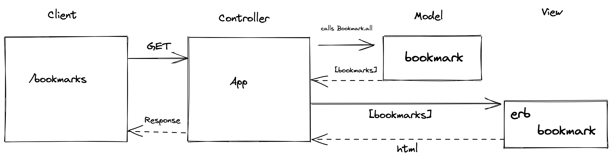

# bookmark_manager

User Stories:

1) As a user, 
So I can quickly access frequently visited sites
I want to see a list of bookmarks

2) As a user,
So I can save a website,
I want to add the address and title to bookmark manager

## Domain Model


## PostgreSQL Database Setup
### Production Database
1) Connect to PSQL in terminal (type: psql)
2) Create the database using psql command CREATE DATABASE bookmark_manager;
3) Connect to the database via psql using \c bookmark_manager;
4) Run the query saved in 01_create_bookmarks_table.sql

### Test Database
1) Connect to psql in the terminal (enter: psql)
2) Create the database using ```psql CREATE DATABASE bookmark_manager_test```
3) Connect to the database using ```\c bookmark_manager_test```
4) Run the query in 01_create_bookmarks_table.sql to create the bookmarks table
